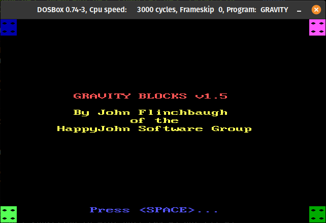
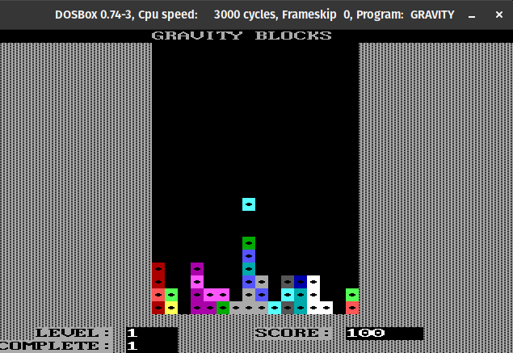
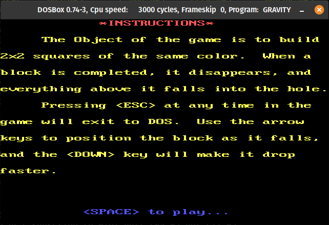

# Gravity Blocks (1993)

This is one of the first games
I wrote in QuickBasic 
and distributed around 1993.

Like most my software,
it builds a bit
a library 
of useful subroutines 
and functions
I had collected over the years.
Much of the library code
is not yet readable to me,
since the source for some of them
seems to be stored in a compressed
QuickBasic format.
Specifically, 
the `Noise` and `Sound`
routines are missing,
but the source for `Delay`
is included.

I still have the binary 
for the game,
though,
and it runs in DosBox.

